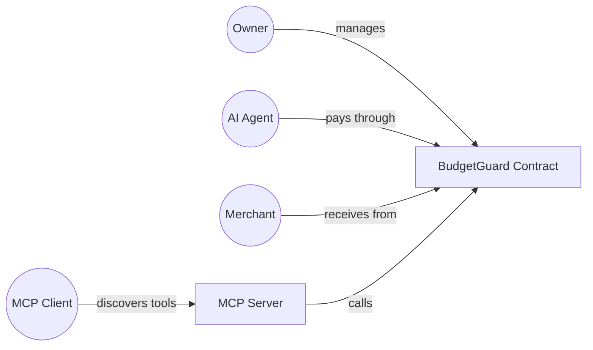
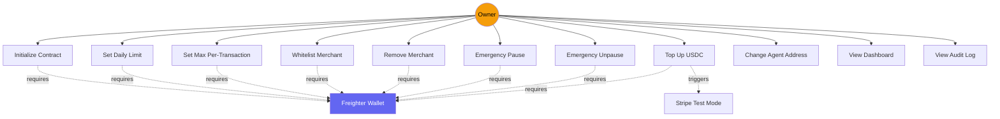
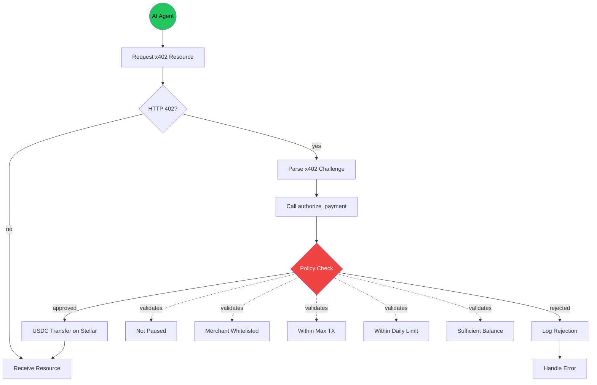
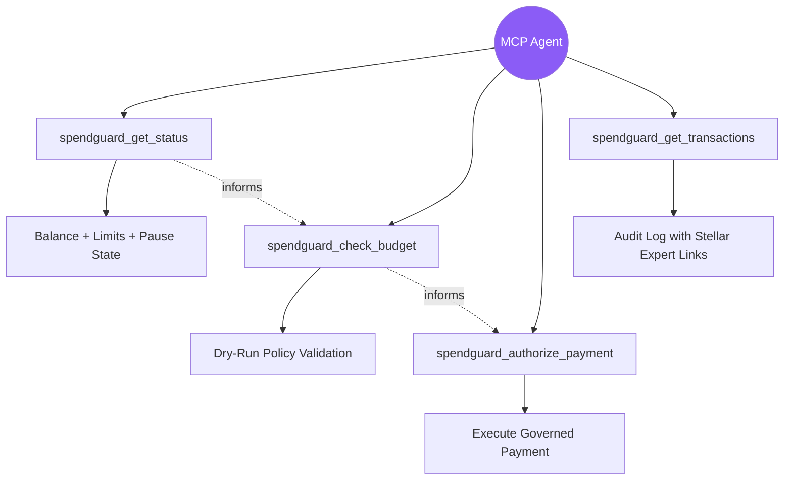
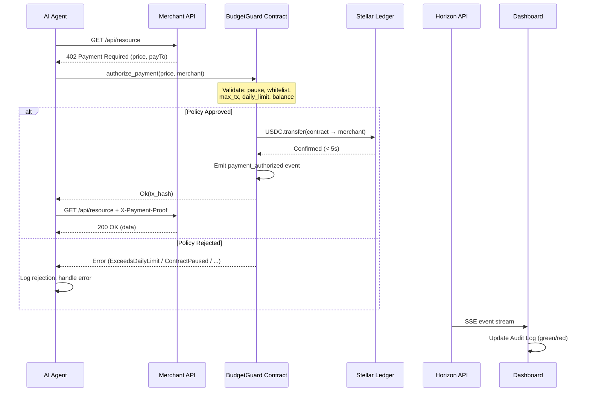
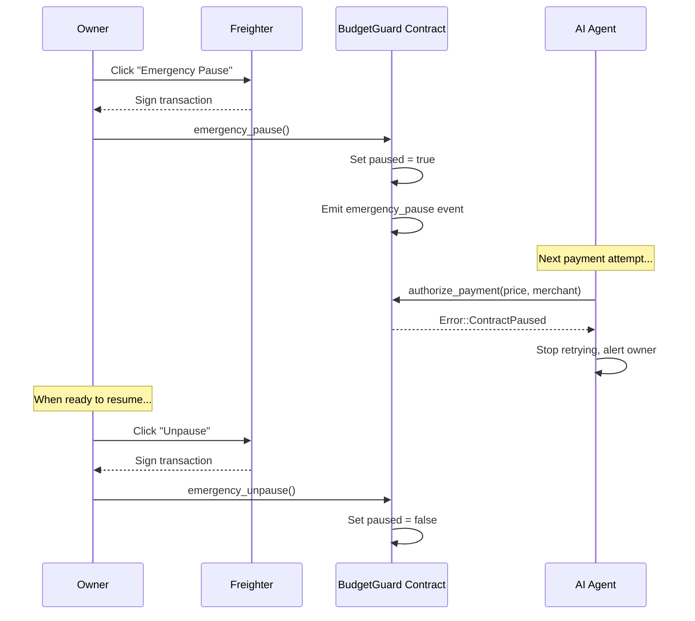

# Architecture

System overview for Stellar 402 SpendGuard. A Stellar engineer should be able
to read this document in 5 minutes and understand every component, its
responsibility, and its boundaries.

---

## One-Sentence Summary

SpendGuard is a Soroban smart contract that acts as the sole payment authorizer
for an AI agent using x402 on Stellar — the agent requests, the contract
decides, the SAC executes.

---

## End-to-End Flow

```
AGENT (Node.js)
     │
     │ 1. GET /api/weather
     ▼
MERCHANT API
     │
     │ 2. HTTP 402 Payment Required
     │    { price: "0.01 USDC", payTo: "G...MERCHANT", facilitator: "https://..." }
     ▼
AGENT (Node.js)
     │
     │ 3. Builds SorobanTransaction invoking
     │    BudgetGuard.authorize_payment(price, merchant)
     │    Signs with agent keypair
     ▼
SOROBAN CONTRACT (BudgetGuard)
     │
     │ 4. Validates:
     │    - paused == false?
     │    - merchant in whitelist?
     │    - price <= max_tx_value?
     │    - spent_today + price <= daily_limit?
     │    - Resets spent_today if > 86400s since last_reset
     │
     │ 5. If valid: calls USDC_SAC.transfer(contract → merchant, amount)
     │    Emits payment_authorized event
     │    Updates spent_today += price
     ▼
BUILT ON STELLAR FACILITATOR (OpenZeppelin Relayer)
     │
     │ 6. Verifies transaction, broadcasts to Stellar ledger
     │    Settlement < 5 seconds
     ▼
MERCHANT API
     │
     │ 7. Confirms payment on-chain
     │    Returns HTTP 200 OK { data: "..." }
     ▼
AGENT (Node.js)
     │
     │ 8. Receives resource, logs result
     ▼
DASHBOARD (Next.js)
     │
     │ 9. Reads Soroban events via Horizon API
     │    Displays in Audit Log with clickable Stellar Expert links
```

---

## Component Table

| Component | Technology | Responsibility | What It Does NOT Do |
|-----------|-----------|----------------|---------------------|
| **BudgetGuard Contract** | Rust + Soroban SDK v22 | Holds USDC via SAC, enforces spending policies, executes transfers internally, emits events | Does not hold agent private keys, does not interact with Stripe, does not serve HTTP |
| **Agent** | Node.js + TypeScript | Polls x402 endpoints, parses 402 challenges, builds Soroban transactions, signs with own keypair | Does not hold fund keys, does not decide spending limits, does not interact with frontend |
| **Backend API** | Node.js + Express + TypeScript | Serves dashboard endpoints, processes Stripe webhooks, calls contract admin functions | Does not make x402 payments, does not hold USDC, does not replace the contract logic |
| **Frontend Dashboard** | Next.js 14 + TypeScript + Tailwind | Displays contract state, provides governance UI (sliders, kill switch), connects Freighter | Does not execute payments, does not bypass contract policies, does not store data |
| **Freighter Wallet** | Browser extension | Signs owner transactions for admin operations (set limits, pause, top up) | Does not sign agent transactions, does not hold contract funds |
| **Built on Stellar Facilitator** | OpenZeppelin Relayer | Relays signed transactions to Stellar ledger, abstracts gas management | Does not custody funds, does not validate spending policies, does not store state |
| **USDC SAC** | Stellar Asset Contract (Circle) | Native USDC token on Soroban, enforces balance constraints | Does not enforce spending limits — that is the contract's job |
| **Stripe (Test Mode)** | Stripe Checkout API | Simulates fiat-to-USDC on-ramp for hackathon demonstration | Does not perform real fiat conversion — it is a simulation clearly labeled as such |
| **Horizon API** | Stellar Horizon Server | Provides access to ledger data, contract events, transaction history | Does not execute transactions, does not store application state |

---

## Why Stellar — The Technical Argument

The question is not "why Stellar over Ethereum" — it is "why is Stellar the
ONLY chain where this architecture works correctly."

### Soroban Custom Account + Auth Framework

Soroban allows a smart contract to act as a programmable account. The
BudgetGuard contract holds USDC and authorizes transfers internally via the
SAC. The agent invokes `authorize_payment()` — the contract validates policies
and calls `token.transfer()` from its own address to the merchant.

**The agent never touches the fund keys.** The authorization is born and dies
inside the contract logic. This is not possible on EVM chains where an EOA
must sign every token transfer, or where contract-based wallets require
complex proxy patterns.

### Secondary Advantages (real, but not the differentiator)

- **Fees:** ~$0.00001 per transaction — micropayments of $0.001 are economically viable
- **Settlement:** < 5 seconds to ledger finality — x402 payments are synchronous HTTP round-trips
- **USDC:** Native Circle-issued asset via SAC, not bridged or wrapped
- **Uptime:** 99.99% since launch, 20.6B+ operations processed

---

## Data Flow

### Payment Authorization
```
Agent → contract.authorize_payment(price: i128, merchant: Address)
  Contract reads: paused, whitelist, daily_limit, max_tx_value, spent_today, last_reset
  Contract writes: spent_today, last_reset (if reset triggered)
  Contract calls: usdc_sac.transfer(contract_address, merchant, price)
  Contract emits: Event("payment_authorized", { merchant, price, spent_today, tx_timestamp })
```

### Admin Operations (via Frontend + Freighter)
```
Owner → contract.set_daily_limit(amount: i128)         — requires owner auth
Owner → contract.set_max_tx(amount: i128)              — requires owner auth
Owner → contract.whitelist_merchant(merchant: Address)  — requires owner auth
Owner → contract.remove_merchant(merchant: Address)     — requires owner auth
Owner → contract.emergency_pause()                      — requires owner auth
Owner → contract.emergency_unpause()                    — requires owner auth
Owner → contract.top_up(amount: i128)                   — requires owner auth + USDC transfer
Owner → contract.set_agent(agent: Address)              — requires owner auth
```

### Dashboard Data
```
Frontend → Horizon API → GET /events?contract=CONTRACT_ADDRESS
Frontend → Backend API → GET /api/status (aggregates contract state)
Frontend → Backend API → GET /api/transactions (formats Horizon events)
Frontend → Backend API → GET /api/balance (reads SAC balance)
```

### HTTP Error Semantics (Demo Endpoint)

The `/api/demo/run-agent` endpoint distinguishes **policy outcomes** from
**infrastructure failures** at the HTTP layer:

| Situation | HTTP | Body | Meaning |
|-----------|------|------|---------|
| Payment approved, data returned | `200` | `{success: true, steps}` | Happy path |
| Contract reverted (ExceedsMaxTx, ContractPaused, …) | `200` | `{success: false, code: "CONTRACT_REVERT"}` | The guard correctly said *no* — this is a feature, not a bug |
| Missing signer keys / bad env | `503` | `{code: "CONFIG_ERROR"}` | Operator needs to fix configuration |
| RPC unreachable, bad sequence, other infra | `502` | `{code: "STELLAR_ERROR"}` | Upstream failure |

Contract reverts surface at two different points in the Soroban flow:
`prepareTransaction()` catches them at **simulation time** before submit; the
post-submit path catches them when the ledger closes. Both code paths normalize
the error message to include the sentinel `"reverted on-chain"` so the HTTP
layer can branch on a single string match. See
[`backend/src/stellar/client.ts`](../backend/src/stellar/client.ts) and
[`backend/src/api/demo.ts`](../backend/src/api/demo.ts).

---

## External Dependencies

| Dependency | Testnet Equivalent | Required For |
|------------|-------------------|--------------|
| Stellar Network | Stellar Testnet (horizon-testnet.stellar.org) | All on-chain operations |
| USDC SAC | Testnet USDC (address in ENVIRONMENT.md) | Token transfers |
| Built on Stellar Facilitator | Testnet facilitator endpoint | x402 payment relay |
| Freighter Wallet | Freighter configured for Testnet | Owner transaction signing |
| Stripe API | Stripe Test Mode (test keys) | Simulated fiat on-ramp |
| Horizon API | Testnet Horizon | Event reading, balance queries |

---

## Use Case Diagrams

### UC1 — Actors Overview



### UC2 — Owner Use Cases



### UC3 — Agent Use Cases



### UC4 — MCP Agent Use Cases



### UC5 — End-to-End x402 Payment Flow



### UC6 — Emergency Kill Switch Flow



---

## Out of Scope

See [TRADE_OFFS.md](../TRADE_OFFS.md) for the complete list of features
deliberately excluded and the rationale for each exclusion. Key items:

- Multi-agent per contract (single agent per contract in MVP)
- Agent reputation scoring
- Real Stripe MPP integration (simulated only)
- Mainnet deployment
- Auto-refill autonomous logic
- Rate limiting beyond daily total
